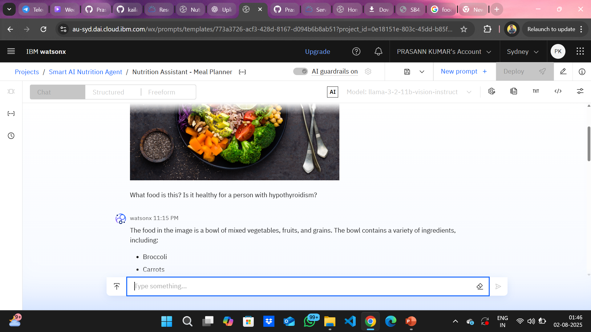
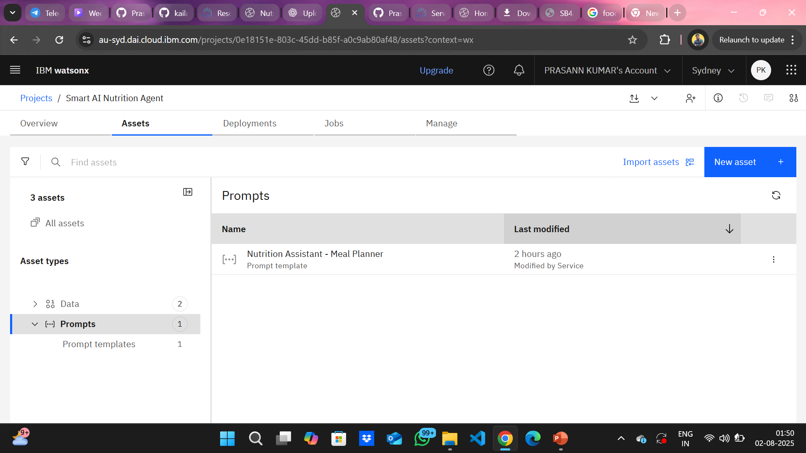

# 🧠 Smart AI Nutrition Assistant

## 🔍 Overview
This project is a virtual nutrition assistant powered by IBM watsonx.ai Granite LLM. It accepts text, voice, and image inputs and provides personalized meal plans with contextual nutritional explanations.

## 🚀 Features
- Multimodal input: Text, Voice (explained in prompt), and Image
- Personalized meal planning using LLM reasoning
- Dynamic feedback and adaptation logic
- Built using IBM Prompt Lab (watsonx.ai)

## 🛠️ Technologies
- IBM Cloud Lite Account
- Watsonx.ai Prompt Lab
- Granite Foundation Models (LLMs)
- 
## 📸 Screenshots

### 1️⃣ Prompt Lab Interface
This shows the AI prompt being tested in IBM watsonx.ai.

### 2️⃣ User Input in text and images + AI Meal Plan Output
This demonstrates how the assistant responds to user input with a detailed, personalized meal plan.

Input in Text

\

Input in Image

### 3️⃣ Final Prompt Saved
Shows the saved prompt named **"Nutrition Assistant - Meal Planner"** in Prompt Lab.

## ⚙️ How it Works
Prompt built to:
- Take user input like age, goal, diet preferences
- Process via IBM's LLM to return customized meal plan
- Adapt suggestions based on user feedback

## ✅ Status
✅ Prompt works successfully in Prompt Lab with multimodal logic.

## 📎 License
MIT

